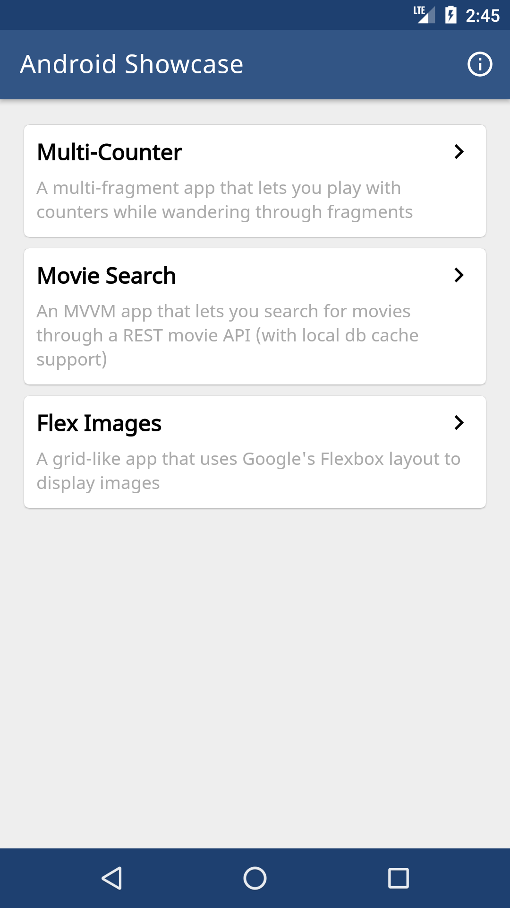
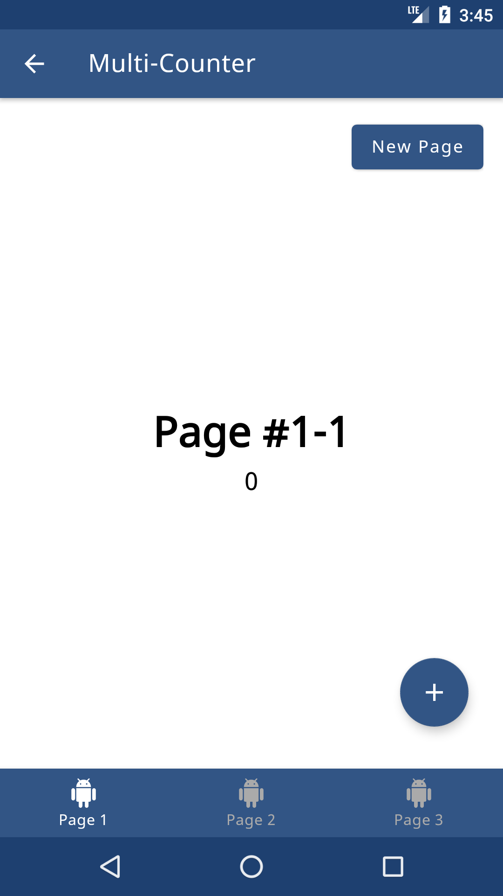
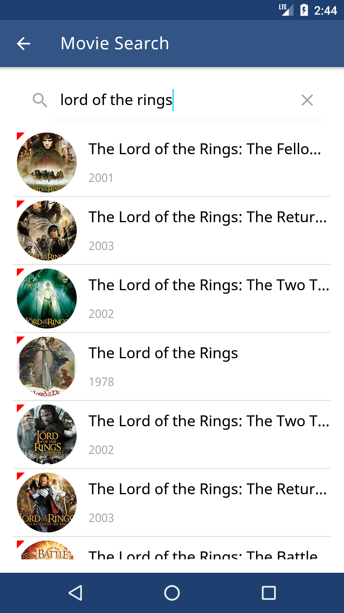

# Android Showcase

[](https://app.bitrise.io/app/4d4cf51c2dab8f0f) [](https://android-arsenal.com/details/3/7392)

**Android Showcase** is a project that exhibits **how to implement common Android stuff in proper and structured way**. To do that, it provides a list of small sub-apps, each of which is implemented utilizing libraries & components that Android developers use on daily basis.

<p align="center">
   
</p>

This project is under constant development. Please feel free to provide suggestions for improvements and point out any flawed approach you see. Every contribution is appreciated!


## List of Apps

Following is the list of sub-apps showcased in this project:

### 1. Multi-Counter

A **multi-fragment** app that lets you play with counters while wandering through fragments

Key libraries showcased:
- [**FragNav**](https://github.com/ncapdevi/FragNav) - Android library for managing multiple stacks of fragments
- [**StateSaver**](https://github.com/evernote/android-state) - A utility library for Android to save objects in a `Bundle` without any boilerplate

### 2. Movie Search

An **MVVM** app that lets you search for movies through a REST movie API (with local db cache support)

Key libraries showcased:
- [**Retrofit**](https://github.com/square/retrofit) - Type-safe HTTP client for Android and Java by Square, Inc.
- [**MMKV**](https://github.com/Tencent/MMKV) - An efficient, small mobile key-value storage framework developed by WeChat
- [**MultiStateView**](https://github.com/Kennyc1012/MultiStateView) - Android View that displays different content based on its state
- [**BRVAH**](https://github.com/CymChad/BaseRecyclerViewAdapterHelper) - Powerful and flexible RecyclerAdapter

### 3. Flex Images

A grid-like app that uses **Google's Flexbox** layout to display images

Key libraries showcased:

- [**FlexboxLayout**](https://github.com/google/flexbox-layout) - A library project which brings the similar capabilities of [CSS Flexible Box Layout Module](https://www.w3.org/TR/css-flexbox-1) to Android
- [**Picasso**](https://github.com/square/picasso) - A powerful image downloading and caching library for Android

### More coming soon...


## List of All Libraries & Components

All the libraries and components used throughout the app are as follows:

#### General purpose

- [**Dagger**](https://github.com/google/dagger) - A fast dependency injector for Android and Java
- [**Data Binding**](https://developer.android.com/topic/libraries/data-binding/) - A support library that allows you to bind UI components in your layouts to data sources in your app using a declarative format rather than programmatically
- [**Architecture Components**](https://developer.android.com/topic/libraries/architecture/)
  - [**LiveData**](https://developer.android.com/topic/libraries/architecture/livedata) - Used to build data objects that notify views when the underlying database changes
  - [**ViewModel**](https://developer.android.com/topic/libraries/architecture/viewmodel) - Used to store and manage UI-related data in a lifecycle conscious way; allows data to survive configuration changes such as screen rotations
- [**AndroidUtilCode**](https://github.com/Blankj/AndroidUtilCode) - A library that encapsulates the functions that are commonly used in Android development
- [**RxJava**](https://github.com/ReactiveX/RxJava) - A library for composing asynchronous and event-based programs by using observable sequences
- [**RxAndroid**](https://github.com/ReactiveX/RxAndroid) - Android specific bindings for [RxJava 2](http://github.com/ReactiveX/RxJava)
- [**Retrofit**](https://github.com/square/retrofit) - Type-safe HTTP client for Android and Java by Square, Inc.
- [**MMKV**](https://github.com/Tencent/MMKV) - An efficient, small mobile key-value storage framework developed by WeChat
- [**StateSaver**](https://github.com/evernote/android-state) - A utility library for Android to save objects in a `Bundle` without any boilerplate

#### User-interface related

- [**FragNav**](https://github.com/ncapdevi/FragNav) - Android library for managing multiple stacks of fragments
- [**BRVAH**](https://github.com/CymChad/BaseRecyclerViewAdapterHelper) - Powerful and flexible RecyclerAdapter
- [**Picasso**](https://github.com/square/picasso) - A powerful image downloading and caching library for Android
- [**Picasso Transformations**](https://github.com/wasabeef/picasso-transformations) - An Android transformation library providing a variety of image transformations for [Picasso](https://github.com/square/picasso)
- [**Android-SpinKit**](https://github.com/ybq/Android-SpinKit) - Android loading animations
- [**MultiStateView**](https://github.com/Kennyc1012/MultiStateView) - Android View that displays different content based on its state
- [**FlexboxLayout**](https://github.com/google/flexbox-layout) - A library project which brings the similar capabilities of [CSS Flexible Box Layout Module](https://www.w3.org/TR/css-flexbox-1) to Android

#### Testing related

- [**Barista**](https://github.com/SchibstedSpain/Barista) - A library built on top of [Espresso](https://developer.android.com/training/testing/espresso/), that provides a simple and discoverable API, removing most of the boilerplate and verbosity of common Espresso tasks
- [**Mockito**](https://github.com/mockito/mockito) - Most popular mocking framework for Java


## Proguard

Proguard is enabled and proguard file covers all libraries used in this project.

The file is configured on top of the proguard file provided in the following Medium article: [**Android: My “default” Proguard configuration file**](https://medium.com/code-procedure-and-rants/android-my-standard-proguard-ffeceaf65521)


## License

```tex
Copyright 2018 UGURCAN YILDIRIM

Licensed under the Apache License, Version 2.0 (the "License");
you may not use this file except in compliance with the License.
You may obtain a copy of the License at

   http://www.apache.org/licenses/LICENSE-2.0

Unless required by applicable law or agreed to in writing, software
distributed under the License is distributed on an "AS IS" BASIS,
WITHOUT WARRANTIES OR CONDITIONS OF ANY KIND, either express or implied.
See the License for the specific language governing permissions and
limitations under the License.
```
